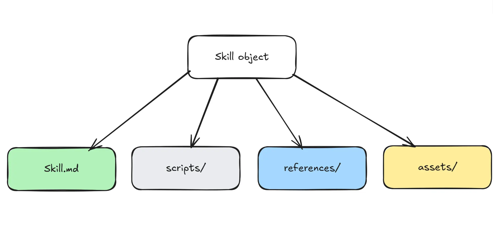

> [!quote] 
> 日养千花气，风和百和香。
君王自仁寿，柏叶更称觞。
> —— 宋 · 毛滂 《春词  其一四》


## 参考资料
- [从第一性原理深度拆解 Claude Agent Skill](https://www.bestblogs.dev/article/c7c9ec14)
- [Claude Skills不就是把提示词存个文件夹吗？](https://www.bestblogs.dev/article/330a8dee)
- [一文带你看懂，火爆全网的Skills到底是个啥。](https://mp.weixin.qq.com/s/nRVVqPaGxWdNqNrUcurSXg)

## Skill是什么？
> [!important]
Anthropic官方定义：**Skills 是一些文件夹，里面放着指令、脚本和资源**，当 Claude 觉得当前任务需要它时，就会动态加载。

一个标准的Skill文件夹结构通常由以下模块组成：


## Skill的组成与加载

加载Skill的过程中最核心的一个概念叫**渐进式披露（Progressive Disclosure）**，流程大致如下：
### 先读“封面简介”——Frontmatter
Agent会扫描所有可用的Skills的前置元数据（Frontmatter），这里主要包含如下信息：

| 字段名           | 类型     | 是否必填 | 描述                                              |
| ------------- | ------ | ---- | ----------------------------------------------- |
| name          | string | Y    | 技能名称，会被用作Skill tool的command                     |
| description   | string | Y    | 技能功能的简要总结。Agent**根据这个判断技能与当前任务是否相关，是否需要调用**     |
| allowed-tools | string | N    | 有权限使用的工具。格式为一个逗号分隔的字符串，例如`“Read,Write”`表示仅限读写文件 |
| model         | string | N    | 可以使用什么模型，默认继承用户会话中当前的模型                         |
| version       | string | N    | 版本，用于版本控制和技能管理                                  |

> [!caution]
> `description`的内容**一定要使用第三人称**，且尽量包含你的触发关键词。
> 例如：“处理Excel文件并生成报告”是一个优秀的description
> 而：“你可以用这个技能处理Excel文件”则是一个比较糟糕的description。

### 再读“说明书正文”——Skill.md

如果在第一步中，Agent读取Skill的元信息后，判断与当前任务相关，需要调用这个技能，则会进一步阅读Skill的详细说明文档，也就是`Skill.md`文件，其内容是一段提示词，包括但不限于以下核心内容：

> [!note]
> - 技能的具体步骤与流程
> - 输出格式要求
> - 具体示例，供Agent参考
> - 风格偏好
> - 其他注意事项等


下面是一个比较典型的`Skill.md`定义：
```markdown
---
# 前置元数据 (Frontmatter)
name: 技能名称
description: 简要的概述
allowed-tools: "Read,Write"
version: 1.0.0
---

# [简短的目的陈述 - 1-2 句话]

## 概览 (Overview)
[此技能做什么，何时使用，提供什么]

## 前置条件 (Prerequisites)
[需要的工具、文件或上下文]

## 指令 (Instructions)

### 第一步：[第一个动作]
[祈使句指令]
[如果需要，提供示例]

### 第二步：[下一个动作]
[祈使句指令]

### 第三步：[最终动作]
[祈使句指令]

## 输出格式 (Output Format)
[如何构建结果]

## 错误处理 (Error Handling)
[失败时怎么做]

## 示例 (Examples)
[具体的使用案例]

## 资源 (Resources)
[如果绑定了 scripts/, references/, assets/ 文件夹，在此引用]
```

一些编写提示词的最佳实践：
- 字数不要太多，最好在5000词以内，避免上下文过载
- 尽量使用祈使句
- 用`{baseDir}`作为路径引用，绝对不要硬编码绝对路径

### 最后加载可执行脚本和文件——scripts/references/assets

当真正要开始执行具体操作的时候，Agent才会把脚本代码、参考文档、静态资源文件等加载到上下文中，避免一开始就撑爆掉。
- `scripts/`：存储Agent可以通过Bash工具运行的可执行代码，如python/shell脚本
- `references/`：存储Agent完成任务所需要的任何参考文档，通常为markdown格式
- `assets/`：存储静态资源，如HTML模板、CSS文件、图片、字体等

> [!tip]
> 渐进式披露的设计意义在于，你可以安装许许多多个SKill，但是Claude只会按需调用，在合适的时机选择合适的技能，避免了上下文爆炸的灾难。

题外话，其实渐进式披露这个概念在以往的移动互联网时代可以说是无处不在了，我们日常使用的app中的菜单栏就体现了这一设计理念：点击头像-菜单栏设置-具体设置界面，层层递进，避免一上来就给用户信息爆炸的困扰。

## Skill vs Prompt

Prompt的一个很大的局限性：它不会在不同的会话之间自动保留。因此自然而然的，**如果你需要反复在多个不同的会话中反复敲同一类prompt，就应该把它们封装进skill里了**。它们可以是：
- 一套固定的审核标准
- 一套固定的分析思路
- 一个标准化的处理模板
- 其他...

## 适用于Skill的工作场景

**其实Agent + Skills，很大程度上就是Workflow的一种呈现**。宝玉老师甚至曾说过，“几乎所有能用 workflow 完成的AI任务，都可以用Agent + Skills实现。” 

换句话说，**Skills的价值，在于复用**。

下面是一些可以有利于Skill发挥的场景：
- 自动化脚本：执行一段固定的python脚本
- 文件转换与数据处理：自动解析文件格式，并按照指定规范转换清洗，最后导出
- 生成结构化报告：例如分析代码库
- 命令链执行：如CI/CD的pipeline
- 基于模板输出：加载`assets/`中存储的模板文件，将数据填入，然后生成报告/模板

