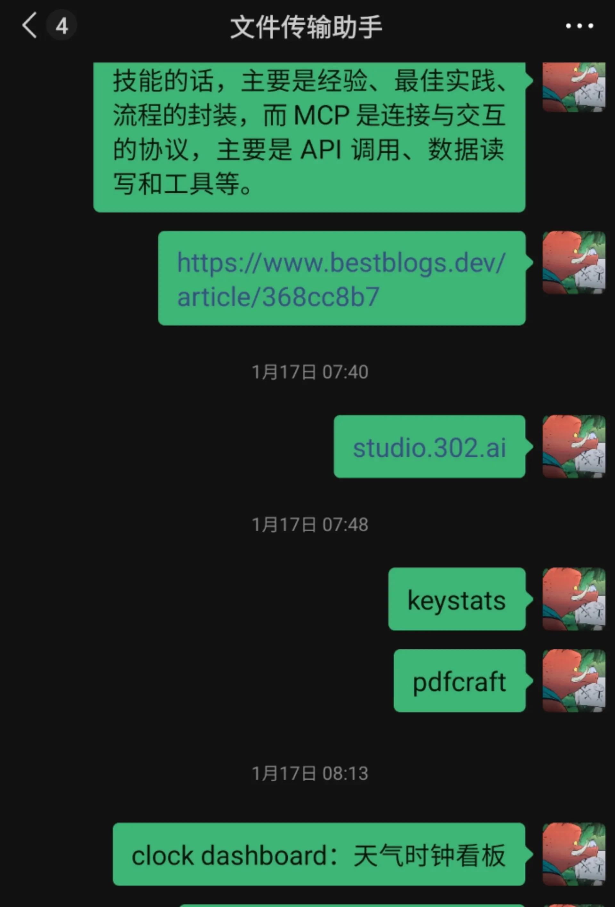
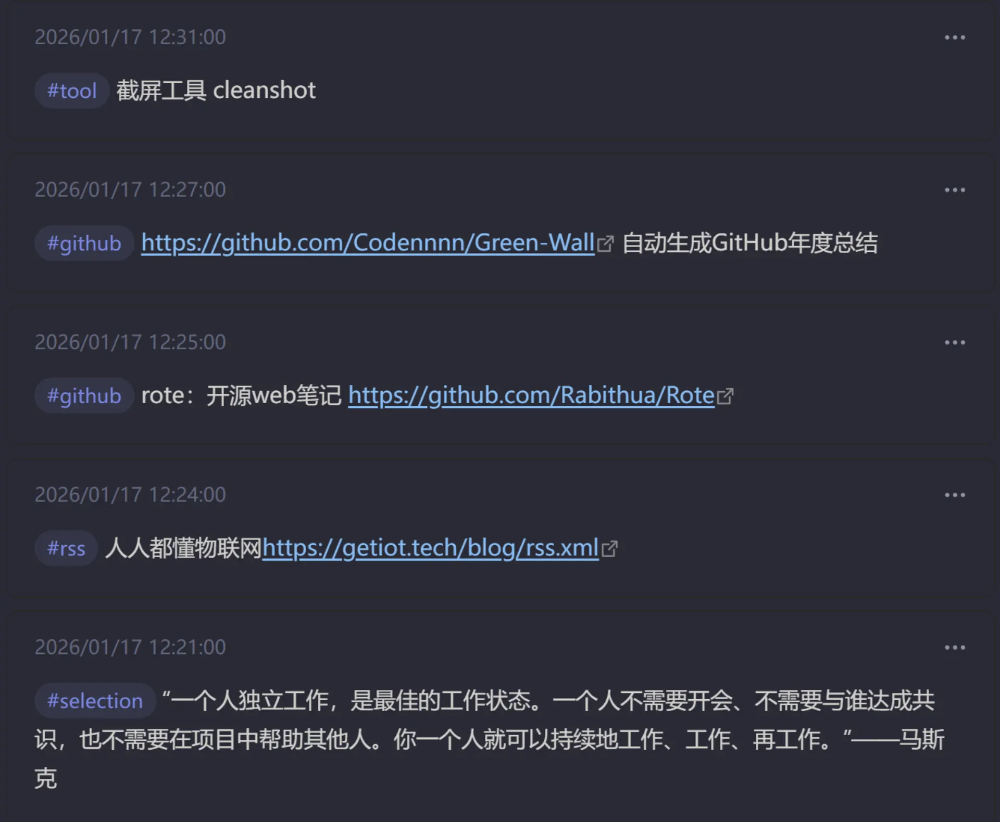
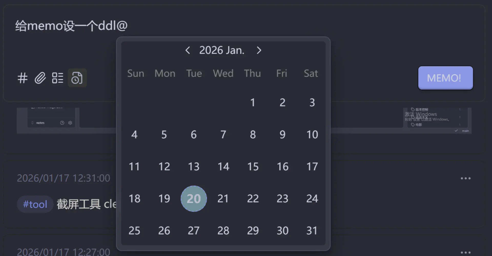
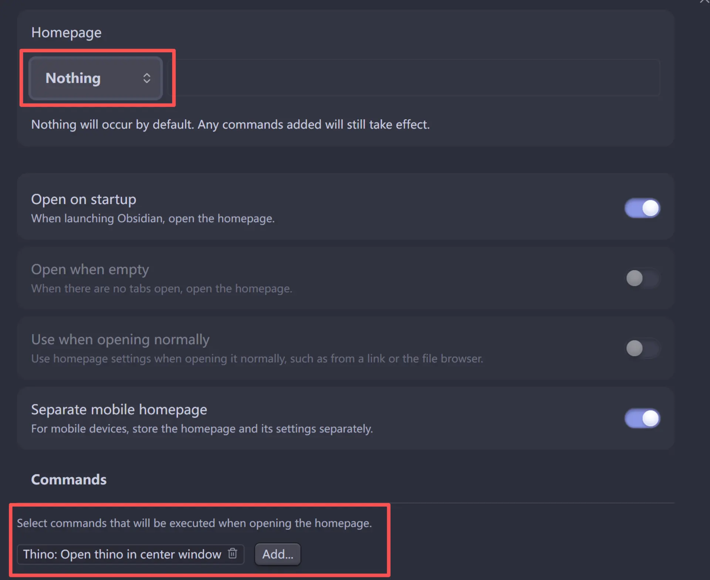
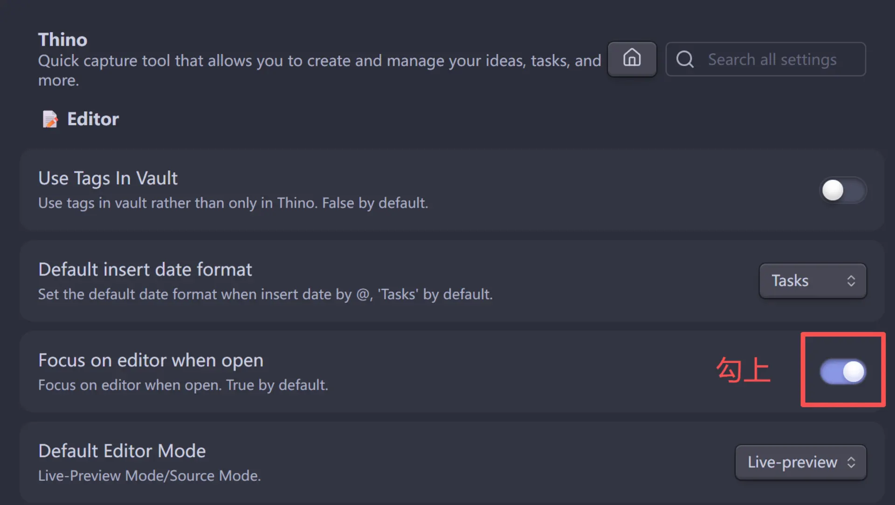

>[!quote] 
> 落星江水接天流，花絮飞时暮雨收。
波底鲤鱼东去否，尺书烦汝到杨州。
> —— 宋 · 释道潜 《寄俞秀老清老二居士  其二》

## 生活中的闪念
日常生活中，经常会遇到下面这样的场景：
- 在看一本小说，突然发现一句说的很cool的话，或者文采很好的段落，想要摘录下来
- 在刷信息流媒体时，看到某一篇文章推荐了一个很好用的工具/网站，准备记下来有空研究一下
- 学习到了一个新鲜的小知识点/专有名词解释
- 突然想起来有一件事需要做，想要记录一个待办，但是不紧急也不算很重要（backlog）
- 其他。。。

我们可以把上述类型所输出的内容，统称为“闪念”，即一闪而过的念头（英文叫memo）。如何管理这些闪念成为了一个老大难的问题。在之前我习惯于借助微信的文件传输助手，把它当成一个树洞，什么东西都往里倒，文采很好的句子、实用小工具、专有名词概念、未来待办事项，等等等等，一股脑的全写进去。好处是微信确实打开方便，随开随记，但坏处是，所有内容几乎都是统一的文字形式，无法区分类别，且很占用微信的内存。

## Thino插件

> 参考的知乎原文：[Memos——用 Obsidian 做卡片笔记](https://zhuanlan.zhihu.com/p/586649087?share_code=MzNTIlBBcX1N&utm_psn=1995776049557033896)

在知乎上搜了一圈，发现了一个比较符合我需求的obsidian插件，叫做memos（现改名叫thino），它可以记录我的零零碎碎的闪念，并且提供了一些非常实用的特性。
### 实时同步daily note

最炫酷的一个特性就是thino**可以将记录的memo实时同步到你的daily note中**，这样每天都不需要打开daily note，只需要在thino的编辑窗口中不停地记录你的闪念即可。只需要你的Obsidian安装了daily note插件并启用，这一特性就会自动生效！同步过去的memo可以选择的呈现形式有list或是task，可以根据个人喜好来。

### 给memo打tag

thino提供了tags的特性，可以为每一条闪念打标签，例如好文好句类的可以打一个`#selection`标签，实用工具类的可以打一个`#tool`标签等等，一个不错的github开源项目可以打一个`#github`的标签等等。这样可以很一目了然地分辨出每一条memo的类型。

### 任务管理

对于一个待办类型的memo，通常你可能会需要分配一个DDL，在thino中，这一操作非常简单，只需要在输入框中打一个@，就会跳出一个小日历，选择时间非常的方便：

### Homepage插件
其实Thino插件对于我来说，最大的使用场景应该是在移动端，我希望能够最大化的提升我记录memo的效率，这就要求最好能够我的Obsidian一打开就是thino的编辑窗口，并且光标能够聚焦在输入框内。

要想实现这一点，只需要安装一个Homepage插件即可。社区插件市场搜索安装，然后配置下面的选项：
- Homepage设为：Nothing
- Commands设为：`Thino: Open thino in center window`

配置完之后，再设置一下Thino插件的Editor部分如下选项：将`Focus on editor when open`勾选上，这样每次打开Obsidian后，会默认加载Thino的编辑界面，并且你的光标会自动聚焦在输入框内，可以无痛开始记录！
