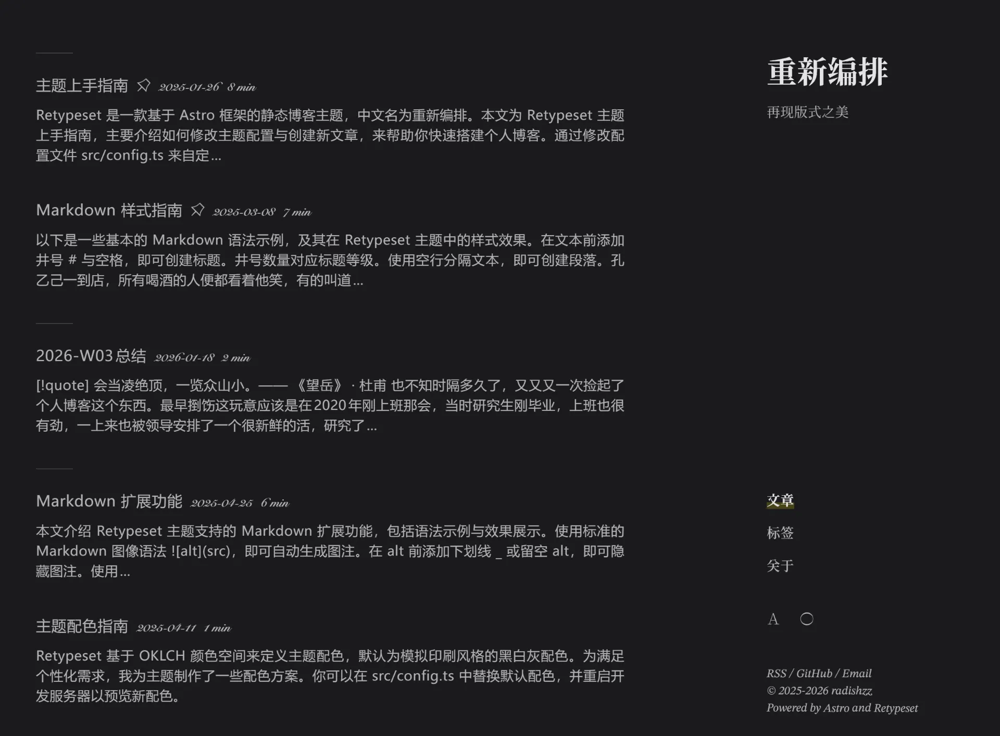
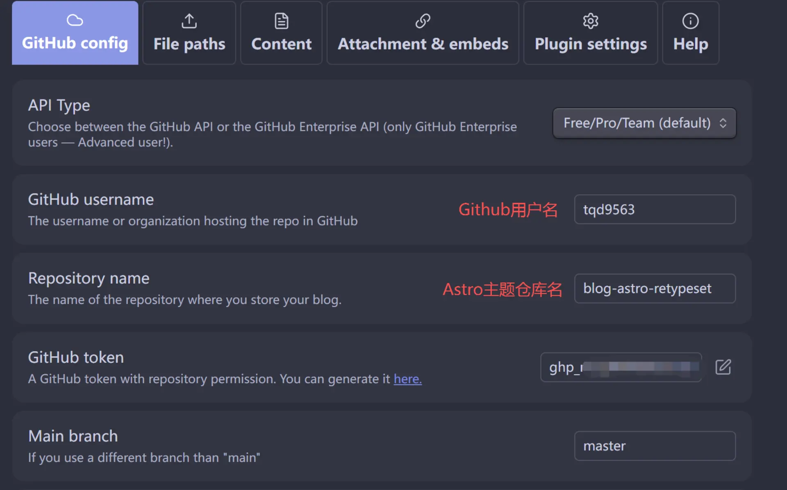
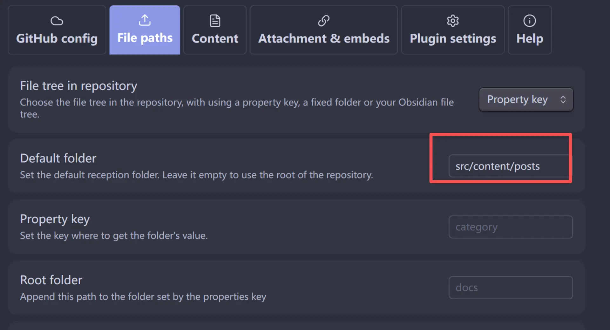
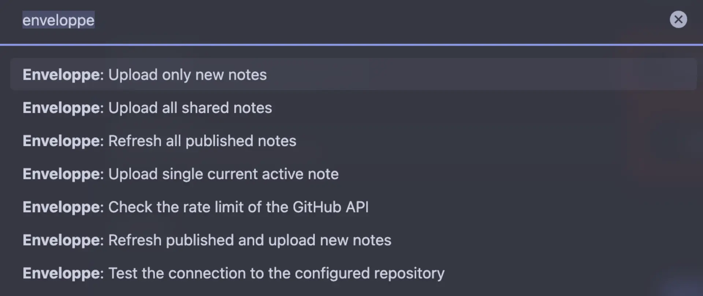

我的这个个人博客是用obsidian +astro +zeabur搭建的，其中obsidian负责文章的编写，astro负责静态网站的编译生成，zeabur负责网站的托管运维。核心最主要用到obsidian中的两个插件：
- Image Converter：负责obsidian客户端侧的图片转化、压缩
- Enveloppe：方便地将笔记发布到指定的github仓库中，并支持个性化的自定义配置

本文主要是记录一下搭建博客过程中踩过的坑，希望对你有所帮助

一些参考文档：
- [Enveloppe 插件适配 Hugo 的配置](https://www.printlove.cn/github-publisher-hugo/)

## 选定一个主题
首先需要选择一个喜欢的博客主题，这里我用的是[retypeset](https://github.com/radishzzz/astro-theme-retypeset)这个主题。跟着相应的Getting Started流程走就行了，安装node.js，pnpm，以及相关依赖，最后本地能够成功启动即可。

## 用Zeabur托管网站

[Zeabur](https://zeabur.cn/)是一个托管平台，类似的还有Vercel, Netlify等等。选择zeabur纯粹是因为相对较新，域名还没有被严重污染。
Astro官方提供了各式各样的云托管平台[部署指南](https://docs.astro.build/en/guides/deploy/)，在里面找到Zeabur的部分，照着做就好了。
> [!tip]
> 一般来说，服务端渲染适配器是不需要的安装的，除非你的博客中有很多需要服务器参与计算的 ，类似于实时点赞之类的功能。

流程走到最后，用zeabur给你绑定的域名访问，能够看到下面的样子就说明成功了（你使用的主题的初始模板）


## 设置你的Enveloppe

Enveloppe插件是这套博客搭建流程中的核心部分，它将博客的编写和编译渲染完全解耦，你可以沉浸式地在你的Obsidian客户端中写你的博客文章，然后通过Enveloppe插件，就可以将你的Markdown文件以及一些附件资源（如图片、音频等）一键同步到你的Astro主题所在的Github仓库，这个仓库存的是HTML、CSS以及一些博客站点的配置文件，**其结构可以和你的Obsidian Vault完全不同！**

首先需要在Github点击头像，开发者设置中生成一个classic的token，权限将repo全部勾选上。然后复制这个token，在Enveloppe插件设置中配置下面这些内容
### GitHub config
只需要修改你的Github用户名，以及对应的Astro主题仓库的名字即可

### File paths

这里设置的是你的Obsidian Vault中的markdown文件（**注意，仅针对markdown文件**），将被推送到目标git仓库中的什么目录下。由于Astro博客的组织形式是固定的，也就是说你的博客文章必须放在指定的目录下，网站才会渲染成功。



这里首先需要将File tree in repository配置成Property key，这样是可以根据每一篇文章的某个具体front matter属性值，将文章映射到Astro Repo的不同目录下。但是我们由于后面要解决图片相对路径的引用问题，这里不需要去填写对应的property key。

然后我们配置Default folder等于`src/content/posts`（视你的主题不同而言）
> [!caution]
> 注意，如果选择默认的Fixed Folder，然后设置Root folder为`src/content/posts`的话，后面你的所有附件内容也会被推送到`src/content/posts/`目录下面去！
> 
> 我不这么做的原因是这样会导致在我的Astro Repo中，md文件与图片的相对层级过于接近，但是在我的Obsidian Vault中，却没办法做到这样（后面会提到，受限于Image Converter插件的能力，生成图片的目录只能是md同级或次一级，但无法做到上一级。。）从而会导致相对引用出现问题。

### Content

这里设置的是你的.md文件中的具体内容，在推送至Astro主题Repo时会做的一些转换（但这不会修改在Obsidian Vault中的.md文件样式）
**这里我们一定需要把Wikilinks to MDlinks勾选上**，因为在Obsidian里往md文件复制一张图片时，默认是用双链的形式，即`![[image_name]]`的形式。如果不勾选这个，Astro那边看到的也是这一串代码，会导致无法准确读取对应的图片资源（因为这是Obsidian的专属语法）。打开勾选后，会强制将`![[image_name]]`转换成标准的md图片语法


### Attachment & embeds

这里配置的是除.md以外的其他文件（如图片、音频、视频等等），将会被推送到Astro主题仓库中的哪个路径下。

这里很关键的一点就是，**你的博客里的图片资源是图床，还是本地文件**。如果是前者，这个配置可以先跳过，因为图床本身是一个url，obsidian不会识别到任何的.png或是.jpg的图片文件，也就不存在推送这一行为了。但是图床可能存在的问题是：
- 图片体积过大，加载速度慢
- 图床链接的访问延迟高，加载速度慢

之前我的博客是用的Picgo +Github作为图床来管理图片的，图片一多起来，整个博客就会卡卡的，加载图片需要好久，浏览体验极差。。于是这次痛定思痛，准备改成本地加载图片的方式（直接复制图片到md文件中）

首先，**Astro有一个图像优化的特性**，它默认会对图片开启懒加载`loading="lazy"`，这样即使你的页面有 100 张图，用户打开页面时，浏览器也只会加载 **首屏（Viewport）** 可见的那 1-2 张图，其余的图片会等到用户滚动到那里时才加载。同时它还会对图片尺寸和格式做优化，转为webp，针对手机生成小图，针对4K屏生成大图。

但是，Astro的上述特性实现基于它能够成功扫描到图片资源，具体逻辑如下：
- 首先扫描markdown文件，捕捉形如``的代码段
- 然后判断这是一个相对路径还是绝对路径：
	- 如果是相对路径：Astro会去读取这个文件，获取宽高，转换格式，最终生成优化后的``标签（带有懒加载的）
	- 如果是绝对路径：Astro会认为这是一个外部文件，原样输出，结果是没有懒加载和尺寸类型转换！！！

因此，首先我们需要保证，**你的Obsidian的markdown文件中，引用图片的语法必须是相对路径引用**。要实现这一点，我们需要用到Image Converter插件，后文会提及如何配置。

除此以外，我们还需要保证的是，**在Obsidian Vault中，md文件与图片文件的相对层级关系，和Astro Repo中md文件与图片文件的相对层级关系完全一致！！** 这一点至关重要，否则会导致Astro找不到图片资源，整个网站挂掉。

想要达成这一目标，我们首先需要做的，是把Stucture配置项给勾上，这样每次通过Enveloppe插件同步时，所有的附件文件会原原本本地按照它们在Obsidian Vault中的目录结构，同步到Astro主题Repo中去。


> 如果不这么做的话，那Enveloppe只提供了另一条路，叫设置一个Default attachment folder，这样会导致什么呢？你所有本地处于不同目录下的图片，将会被同步到Astro主题Repo中的相同目录下！显而易见的是，这会导致两边的.md和图片之间的相对层级关系发生了变化，违背了我们的目标。

在此基础上，我们还需要规范我们本地的图片路径，以及markdown文件路径，这一点稍后会在Image Converter插件的配置中讲到。

## 设置你的Image Converter
> [!note]
> 这一步非必需，如果你用自己的图床管理图片资源，就不需要安装这个插件。只有图片资源全部放在obsidian本地的才需要。

Image Converter插件可以在往markdown文件里复制一张图片时，自动进行压缩裁剪，并修改其保存的路径和文件名。这里我们需要改的配置如下：
### Folder
更改图片处理后保存的路径。插件提供了下面几种可选配置：
- Root folder：全部保存在根目录
- Same folder as current note：与当前笔记处于并列层级
- In subfolder under current note：位于当前笔记的子目录下（注意，这个会在当前笔记所在目录下新增一个与笔记同名的文件夹）
- Custom：自定义路径

我们逐个来拆解，首选如果选择全部保存在根目录肯定是不行的，这会导致根目录异常臃肿；其次，如果图片保存在与当前笔记处于并列的层级，在我们的obsidian客户端上看，也会显得很臃肿，无法有效区分图片还是笔记；第三，如果选择位于当前笔记的子目录下，会出现下面的样子：

```ascii
Obsidian Vault
├── parent_folder
│   ├── note.md
│   ├── note
		└── image.webp
```
还是很怪好不好？这样乍一看，会同时存在两个同名的文件/文件夹。

因此我们只能选择第四种自定义路径的方式。选择+ Add New，Location选择Custom自定义，自定义路径写`src/assets/{notename}`。这样配置的原因是
1. 路径与Astro主题Repo的资源路径对齐，便于后续在解析相对路径引用时不会失败
2. 同一个博客下的图片资源，会被归类在同一个目录下，便于后续管理维护（`{notename}`是插件预定义好的一个变量，表示当前的文件名）

例如这篇博客中的图片文件都会保存在`src/assets/用 Obsidian搭建个人博客/`目录下。


### Filename
选择自定义名字，注意If an output file already exists选项要改为添加数字后缀，防止后来的图片覆盖前面的旧图片。


> [!important]
> 此时注意，经过上面两步Folder和Filename的配置后，我们在某一个`{notename}.md`文件中添加的图片，将会被保存在`src/assets/{notename}/image.webp`这个路径之下。

到这里，我们再回过头去看Enveloppe插件里的Attachment & embeds配置，当时我们配置的是按Vault中的原本structure进行同步，也就是说，对于`{notename}.md`这个文件而言，它所用到的图片资源，全都会被同步到Astro主题Repo的`src/assets/{notename}/`目录下。

现在我们还差最后一步，就是确保本地的md文件被同步过去后，能够顺利读取到图片的相对路径：

| 文件            | 在Obsidian Vault中的目录                | 在Astro Repo中的目录                    |
| ------------- | ---------------------------------- | ---------------------------------- |
| {notename}.md | ？？？                                | `src/content/posts/{notename}.md`  |
| {image}.webp  | `src/assets/{notename}/image.webp` | `src/assets/{notename}/image.webp` |
由于在Astro Repo中，md文件里的图片相对路径引用代码，与在Obsidian  Vault中的代码是完全一致的，所以，我们只需要做一件事，那就是调整Vault中的md文件相对于`src/assets/{notename}/image.webp`目录的相对路径，使其和`src/content/posts/{notename}.md`相对于`src/assets/{notename}/image.webp`的相对路径完全一致即可。

不难倒推出：**Vault中md的目录格式必须是形如`layer1/layer2/layer3/{notename}.md`这样的**，这样两边的相对路径引用都会等于`../../../src/assets/{notename}/image.webp`

> [!important]
> 总结就是：我们需要调整Obsidian  Vault中的目录组织结构，对于任意一篇想要发布到博客上的文章而言，都必须有前置的三层文件夹。
> 
> 比如在我这里：
> - 某一周的周记，它的目录层级可能是`F.日记/2026/2026-01/2026-W03总结.md`
> - 某一篇AI相关笔记，它的目录层级可能是`A.技术/A02. AI人工智能/Prompt/PPT大纲生成.md`


### Conversion
这里可以设置对图片进行的转换操作，包括转换精度（通常75-80范围内，肉眼和原图看不出什么区别），转换格式（推荐webp），裁剪（宽度1920）

### Link format
注意，这里需要修改图片链接格式为Markdown，**路径模式为相对路径**，具体原因在前面已经讲过了，目的是为了Astro的懒加载和图片性能优化特性能够顺利执行。


## 关于同步
Enveloppe插件提供了如下这些同步命令：

### Upload操作

- `Upload only new notes`：只同步全新的笔记（未曾发布过，在Astro Repo中不存在的）
- `Upload all shared notes`：同步所有shared=True的笔记，及其附件
- `Upload single current active note`：看描述应该是只同步当前窗口内打开的笔记，但是我实测下来会报错说token invalid。。。

### Refresh操作
- `Refresh all published notes`：只会同步最近有过编辑且已经发布过的笔记（即存在于你的Astro Repo里的md文件）
- `Refresh published and upload new notes`：不仅会同步最近有过编辑且已经发布过的笔记，也会将全新的笔记同步过去

目前尝试下来，无论是用哪个命令，凡是被修改过或是新增的md文件，其附件必定会被一同同步一遍过去（即使关闭了Forced Updates选项也是如此。。）因此，为了减少同步的md文件数量，每次发布选择的命令是`Refresh published and upload new notes`